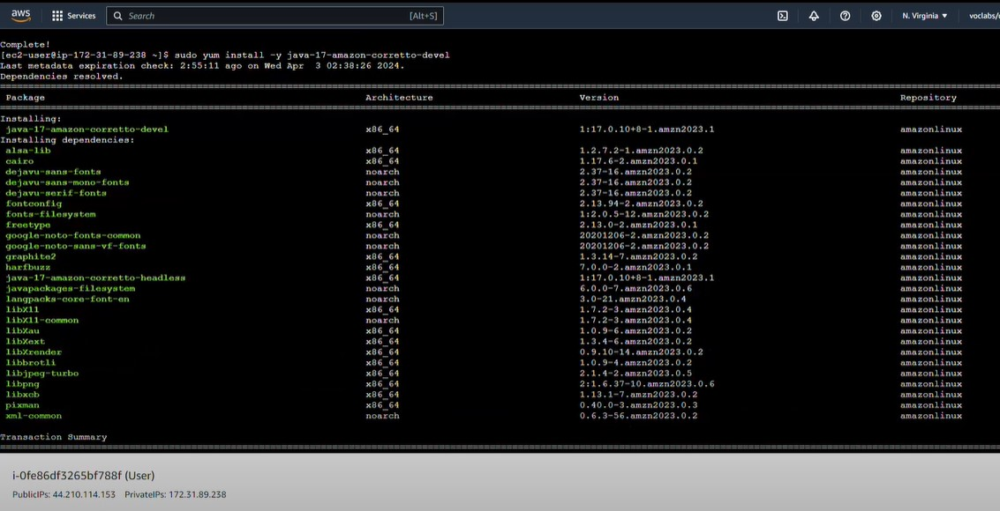
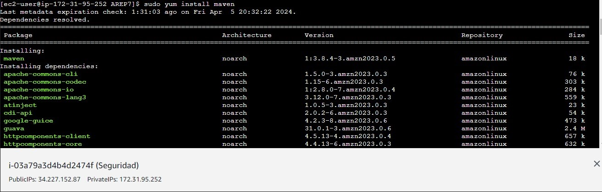
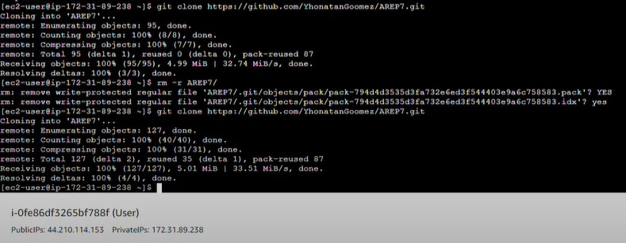
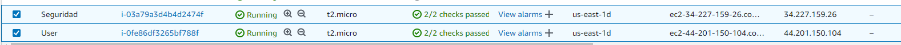
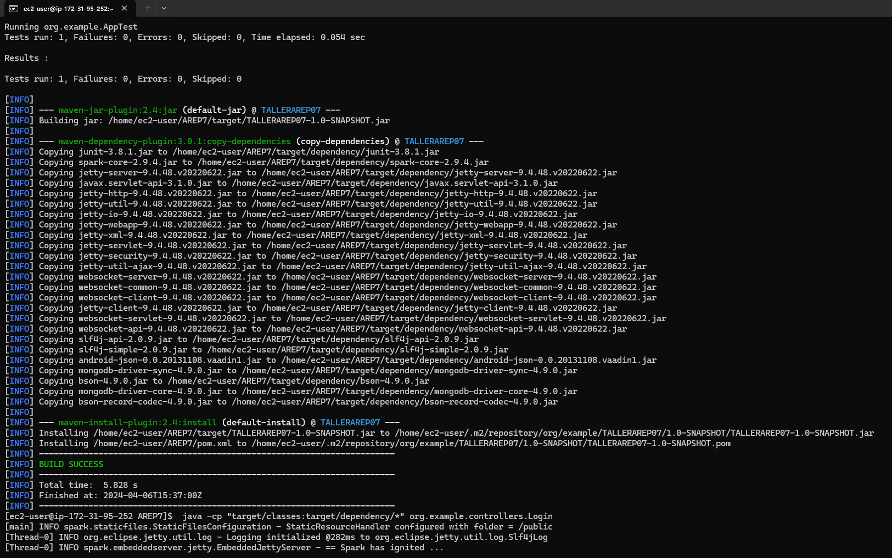
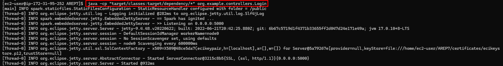
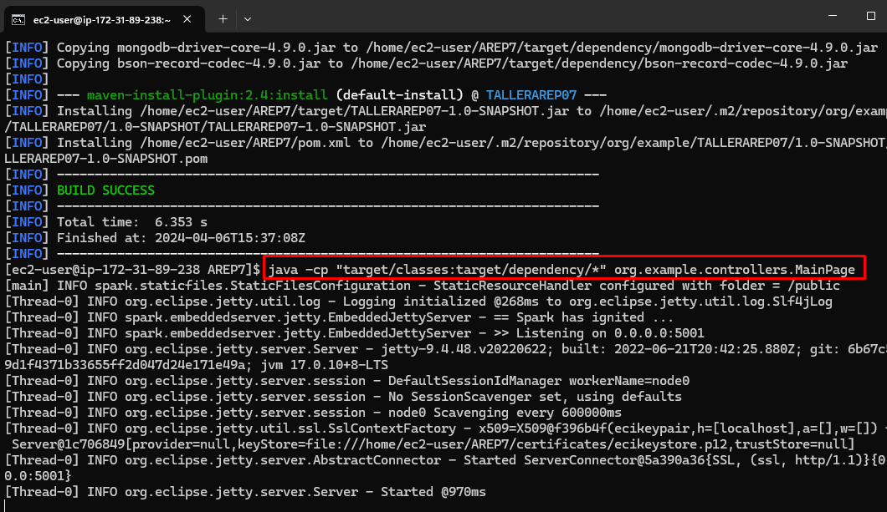
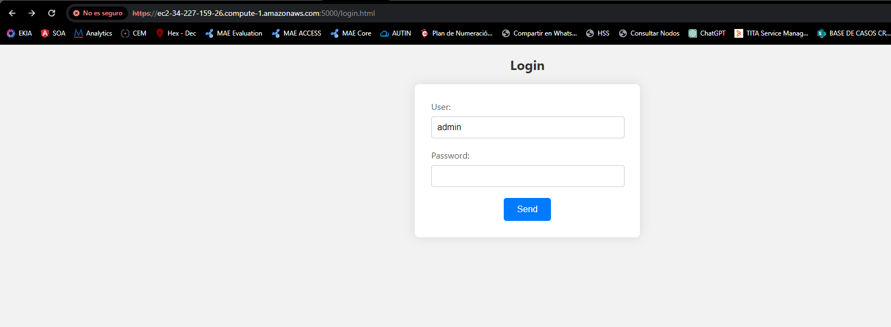
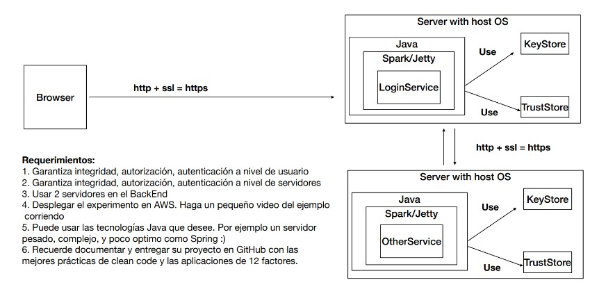

# APLICACIÓN DISTRIBUIDA SEGURA EN TODOS SUS FRENTES

Una solución integral para garantizar el acceso seguro desde el navegador a la aplicación web, manteniendo la autenticación, autorización e integridad de los usuarios. Diseñado para facilitar una comunicación segura entre computadoras y proteger el acceso a servicios remotos mediante autenticación y autorización rigurosas.

## Getting Started

Estas instrucciones te permitirán obtener una copia del proyecto en funcionamiento en tu máquina local para fines de desarrollo y pruebas. Consulta la sección de despliegue para obtener notas sobre cómo desplegar el proyecto en un sistema en vivo.

### Prerequisites

Antes de comenzar, necesitarás instalar el siguiente software:

- Git
- Maven
- Spark
- Java

# Installing

Sigue estos pasos para configurar tu entorno de desarrollo en las dos instancias de AWS:

## Github y Java

En ambas instancias instalaremos github para así poder clonar nuestro repositorio, además que también tendremos Java en ambas virtualizaciones 

#### Instalacion de git:

```bash
sudo yum install -y git
```


#### Instalacion de java:

```bash
sudo yum install -y java-17-amazon-corretto-devel
```



#### Instalacion de Maven:

```bash
sudo yum install maven
```




## Clona el repositorio
git clone https://github.com/YhonatanGoomez/AREP7.git


cd /AREP7


# Instala las dependencias del proyecto
`mvn compile`
`mvn clean install`

# Ejecuta el servidor de desarrollo
En la primera instancia ejecutaremos el siguiente comando:

```bash
java -cp "target/classes:target/dependency/*" org.example.controllers.Login
```
Y en la segunda instancia ejecutaremos el siguiente comando:
```bash
java -cp "target/classes:target/dependency/*" org.example.controllers.MainPage
```

Después de seguir estos pasos, podrás acceder a la aplicación en `http://localhost:5000`.

## AWS

Ahora, para desplegar el proyecto en AWS necesitaremos crear dos instancias (User, seguridad) en las cuales deberemos de instalar Github, Java y Maven, clonaremos el repositorio creado anteriormente y lo ejecutaremos




##### Ejecucion



El siguiente paso sera las clases de los controles en las instancias, como se observa a continuacion:



Una vez corriendo ambas instancias ingresaremos a la direccion IPV4 que nos brindan las instancias de Amazon, en nuestro caso sera la de la instancia User, por el puerto definido anteriormente en donde veremos la siguiente interfaz



Las demostraciones y funcionamiento se explicaran en el video seccion `Prueba y Despliegue en AWS`


## Built With
- **Java** - Lenguaje con el cual funciona la mayor parte del proyecto
- **Html** - Usado para la sección del cliente
- **JavaScript** - Este lenguaje le permite al cliente realizar las peticiones necesarias
- **Maven** - Usado para la construcción de la estructura del proyecto
- **Git** - Usado para el versionamiento
- **Docker** - Es un software que permite crear imágenes y correr contenedores
- **Spark** - Framework con el cual se realizó el API
- **AWS** - Plataforma de servicios en la nube que maneja almacenamiento, bases de datos, análisis, inteligencia artificial, aprendizaje automático, Internet de las cosas (IoT), seguridad y mucho más.


## Arquitectura


Este sistema dedicado a la verificación de identidades atiende requerimientos cifrados en el puerto 5000, respaldado por un certificado SSL para la seguridad en el intercambio de datos. Está configurado para procesar solicitudes tipo POST bajo la ruta /login y establece conexión con la página principal, MainPage, para su funcionamiento integral.



## Authors

- **Yhonatan Steven Gómez Jiménez**


## Prueba y Despliegue en AWS

https://youtu.be/RXL2I_4y7yw